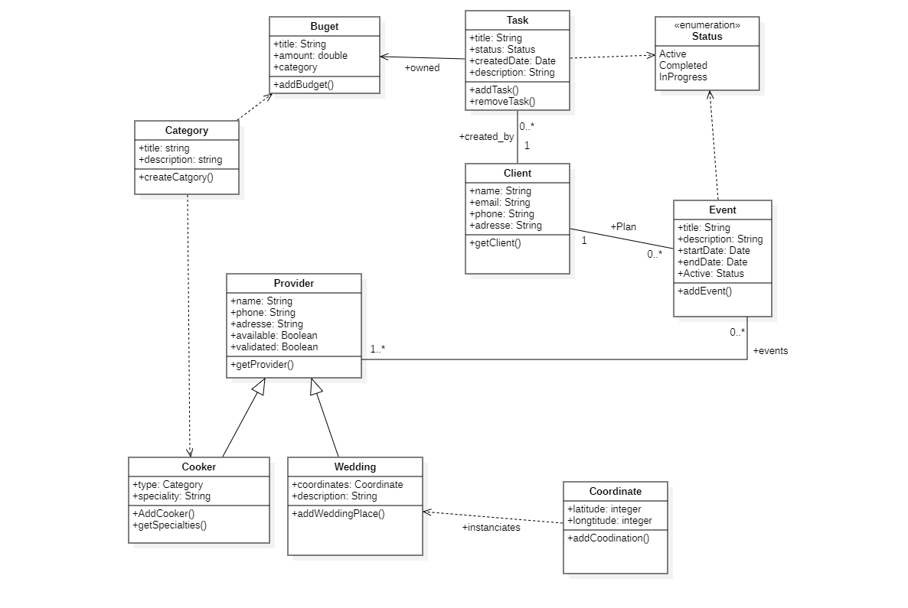

# Wedding Planner

## Description

In the season of summer we need a time to take some rest and/or see families, also in the season there is a plenty of families that organize a weeding event for his/her children and passing all the times in calls with the agent managers for an available date to visit the wedding space and have an idea which the day will be like on the reserved date, so in this context we found many generated conflicts between clients and agent managers because it can be possible like in Tunisia my origin country to visit the space in the same day with other persons so the result will be feeling pressed or uncomfortable to check all services of the wedding space.

## Why this project ?

The main goal of this project is allowing to couples or families manage budgets and reservation in one place and render clear the visibility of what exactly needs.

The principle services of the **project**:
- Budget manager
- Timesheet and calender.
- Search engine

The main functionalities of **platform**:

- Board contain a list of budgets by categories
- Calender contain all visits types (wedding space, pastry or travel agency)
- Filter calender by events or tasks
- Status and notifier contain all accomplished tasks and control budgets
- Search engine page: 
    - Search pastries
    - Search Wedding spaces
    - Search restorer

## Design 

This part contain a diagram class that contain all models of web application.



## Technical part

### How to run your application.

### __1- Install requirements packages__

```
pip install -r requirements.txt
```

### __2- Run application__

In the current project don't forget to install the package `virtualenv`.

Run the following commands for starting the web application

```
    - virtualenv venv`
    - source venv/Scripts/activate
    - python manage.py makemigrations
    - python manage.py migrate
    - python manage.py runserver
```


